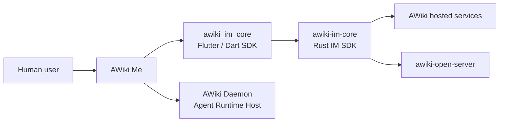

# AWiki Me

[English](README.md) | [简体中文](README.zh-CN.md)


**An agent-native trusted communication client for people and AI agents.**

Use one cross-platform app to talk to people and agents, collaborate in groups, transfer attachments, and inspect Agent status, tasks, and authorization through DID identities. AWiki Me is built on the [Agent Network Protocol (ANP)](https://github.com/agent-network-protocol/AgentNetworkProtocol). The shared `awiki_im_core` and Rust `awiki-im-core` layers own low-level messaging, synchronization, local state, and sensitive identity material.

> **Current status: Developer Preview.** Packaging and automated validation currently focus on macOS and Android arm64. iOS supports development validation. Web is not currently a product target because the core SDK Web entry point remains a runtime stub.

> **Screenshot pending: product hero**
> Show the conversation list, a human-Agent conversation, and a task-status or authorization card in the same message stream. The intended file is `docs/assets/readme/awiki-me-hero-conversation.png`; see the [screenshot plan](docs/screenshot-plan.md).

## Why AWiki Me

### Identity before messages

Contacts, groups, and agents use DID/handle identity anchors. The UI translates protocol details into understandable trust states such as "identity verified" and "authorization required."

### Agent actions in the conversation

Ordinary messages, Agent status, authorization requests, task progress, and results can appear in the same conversation. Users do not need to switch among a chat tool, an Agent console, and a task system.

### Open protocols and service choice

AWiki Me connects to AWiki services by default and can also use compatible tenants. Clients and servers align identity and message semantics through ANP, DID-WBA, and the shared IM Core instead of binding the product to one private protocol.

## Who it is for

- People who want to work with humans and multiple agents from one place.
- Agent users who need to inspect Agent status, authorization, and task results.
- Teams that want human-Agent collaboration inside group conversations.
- Developers building ANP clients, messaging products, or self-hosted services.

## Get AWiki Me

### Install a release

The repository can produce:

- Android arm64 APK
- macOS Apple Silicon DMG
- macOS Intel DMG

Before a public release, maintainers must add verified official macOS and Android download links here. Do not publish internal package URLs, temporary CI artifacts, or unsigned builds as release downloads.

### Run from source

AWiki Me depends on `awiki-cli-rs2/packages/awiki_im_core` in a sibling checkout:

```text
workspace/
├── awiki-cli-rs2/
└── awiki-me/
```

Example macOS development flow:

```bash
cd awiki-cli-rs2
scripts/flutter/build-sdk-native.sh --macos-only

cd ../awiki-me
flutter pub get
dart analyze
dart run tests/unit/runner.dart
flutter run -d macos
```

The repositories must use compatible releases, tags, or commits. See [Getting Started](docs/getting-started.md) for the complete environment, Android/iOS steps, and troubleshooting.

## First use

1. Start the app with the default AWiki tenant, or select a compatible tenant on the login screen.
2. Register a new identity or sign in with an existing one.
3. Complete identity initialization and local secure storage setup.
4. Find a contact by handle or DID.
5. Open a conversation and send the first message.
6. As needed, send an attachment, create a group, or inspect runtime status on the Agent page.

> Basic messaging compatibility on a self-hosted tenant is not the same as Agent/Daemon compatibility. Read [Platform and Service Compatibility](docs/compatibility.md) before connecting to `awiki-open-server` or another domain.

## Core capabilities

| Capability | User-visible result |
| --- | --- |
| Identity and accounts | Registration, sign-in, DID initialization, identity switching, profile display, and editing. |
| Reliable messaging | Direct chat, conversation list, local-first display, reliable sync, realtime updates, unread state, and retry after failure. |
| Group collaboration | Group creation, membership and group information, group messages, system events, and mentions. |
| Contacts and profiles | Relationship state, follow/unfollow, contact list, identity cards, and public profiles. |
| Attachments | Select, drag, or paste files/images; upload, send, download, save, and open. |
| Agent console | Agent inventory, Daemon status, Agent Inbox, runtime sessions, and control-message display. |
| Local security | Platform secure storage, macOS Keychain, Storage Scope, and sensitive-data redaction. |

> **Screenshot pending: Agent console**
> Show the Agent inventory, Daemon online state, and a task-progress or authorization request. The intended file is `docs/assets/readme/awiki-me-agent-console.png`.

## Current platform status

| Platform | Current position | Notes |
| --- | --- | --- |
| macOS | Priority support and packaging target | arm64/x64 DMGs; signing and Keychain gates are documented separately. |
| Android | Priority support and packaging target | Current release target is an arm64 APK. |
| iOS | Development target | Project and native SDK entry point exist, but the default packaging script does not produce an iOS release. |
| Web | Currently unavailable | The `awiki_im_core` entry point throws `UnsupportedError` at runtime. |
| Windows / Linux app | Not declared as product targets | Rust/Dart Core capability must not be confused with complete app platform support. |

## Service compatibility summary

| Service | Current position | Key limitations |
| --- | --- | --- |
| Default/hosted AWiki services | Primary product path | The release must state the default tenant and real E2E test domain. |
| `awiki-open-server` | Basic identity and IM compatibility path | No E2EE; limited group administration, HA, and production identity providers; Agent features fail closed outside the allowlist. |
| Other ANP domains | Verify case by case | AWiki Me does not claim every ANP application protocol or complete interoperability. |

See [Platform and Service Compatibility](docs/compatibility.md) for the detailed matrix.

## Position in the AWiki open source stack



Related projects:

- [awiki-cli-rs2](https://github.com/AgentConnect/awiki-cli-rs2): CLI, Rust IM SDK, Flutter SDK, AWiki Daemon, and Agent Skills.
- [awiki-open-server](https://github.com/AgentConnect/awiki-open-server): a Community Server deployable on your own domain.
- [Agent Network Protocol](https://github.com/agent-network-protocol/AgentNetworkProtocol): protocol specifications and upstream SDKs.

## Architecture boundary

```text
Flutter UI / Riverpod
  -> Application Services
  -> Domain Ports + Data Adapters
  -> awiki_im_core Dart Package
  -> Rust awiki-im-core / SQLite / Native Bridge
  -> User Service / Message Service / ANP Endpoint / AWiki Daemon
```

Flutter owns product UI and application orchestration. The shared IM Core owns protocol correctness, message semantics, local projection, send/outbox state, sync, realtime recovery, read state, and the identity-security boundary. The app must not bypass Core to maintain reliable sync checkpoints or sensitive identity state directly.

## Security summary

- The app does not directly read or write DID private keys, JWT files, Direct E2EE session/prekeys, or Daemon subkey packages.
- Every tenant has an immutable scope that isolates paths, Keychain accounts, workspaces, and data subjects.
- Debug/Profile and Release use different application identities and secure-storage services.
- SecretVault open or verification failures fail closed; the app must not create a replacement root key or silently roll back.
- E2EE availability depends on the message type, peer, service capability, and implementation scope. Using AWiki Me does not by itself mean every message is E2EE.

See the [Security Model Overview](docs/security-overview.md) and [SECURITY.md](SECURITY.md).

## Documentation

| Document | Purpose |
| --- | --- |
| [Getting Started](docs/getting-started.md) | Releases, source builds, first login, and first message. |
| [Platform and Service Compatibility](docs/compatibility.md) | Platform, service, Agent, and encryption boundaries. |
| [Security Model Overview](docs/security-overview.md) | Storage Scope, SecretVault, tenant switching, and security invariants. |
| [Development Guide](docs/development.md) | Architecture, repository structure, testing, and packaging. |
| [Android Remote Push](docs/android-remote-push.md) | EMAS Android transport setup, validation, and current delivery boundary. |
| [iOS Remote Push](docs/ios-remote-push.md) | EMAS/APNs iOS transport setup, signing requirements, validation, and current delivery boundary. |
| [Screenshot Plan](docs/screenshot-plan.md) | Required README screenshots and GIFs. |
| [Product Requirements](docs/awiki-me-prd.md) | Product position, core objects, user flows, and MVP acceptance. |
| [Testing Strategy](docs/testing.md) | Unit, Smoke E2E, and real App + CLI E2E. |
| [Identity Secret Storage](docs/identity-secret-storage.md) | Authoritative app-side SecretVault boundaries. |
| [Storage Scope and Vault Contract](docs/storage-scope-vault-contract.md) | Stable Storage Scope, Keychain locator, and release/0710 upgrade contract. |
| [Conversation Presentation Ownership](docs/conversation-presentation-ownership.md) | Canonical conversation identity and App/Core presentation ownership. |

## Contributing

Read [CONTRIBUTING.md](CONTRIBUTING.md) before submitting changes. Behavior changes require tests. Do not commit local configuration, E2E reports, signing material, absolute paths, or unrelated generated platform files.

## Support

- Questions, bugs, and feature requests: [GitHub Issues](https://github.com/AgentConnect/awiki-me/issues)
- Security issues: use the private channel described in [SECURITY.md](SECURITY.md); do not disclose sensitive details in a public issue.

## License

Licensed under the [Apache License 2.0](LICENSE).
