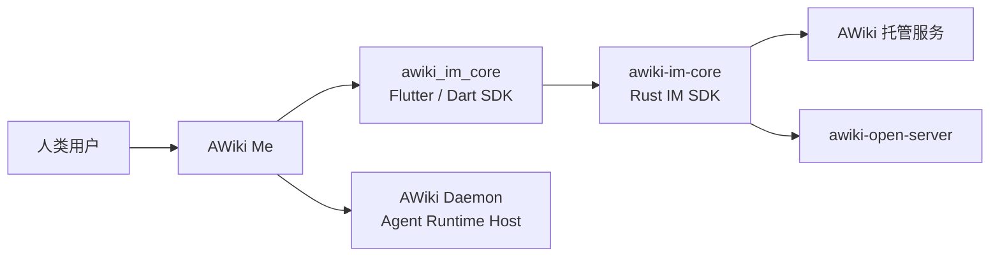

# AWiki Me

[English](README.md) | [简体中文](README.zh-CN.md)


**面向人类与智能体的 Agent 原生可信通信客户端。**

在一个跨平台应用中，与人和 Agent 对话、在群组中协作、传输附件，并通过 DID 身份查看 Agent 状态、任务和授权。AWiki Me 基于 [Agent Network Protocol（ANP）](https://github.com/agent-network-protocol/AgentNetworkProtocol)，底层消息、同步、本地状态和敏感身份材料由共享 `awiki_im_core` / Rust `awiki-im-core` 负责。

> **当前状态：Developer Preview。** 当前打包和自动化验证重点是 macOS 与 Android arm64。iOS 工程可用于开发验证；Web 当前不是可用产品目标，因为核心 SDK 的 Web 入口仍是运行时 stub。

> **截图待补：产品 Hero 图**
> 建议展示左侧会话列表、人与 Agent 的对话，以及同一消息流中的任务状态或授权卡。文件建议为 `docs/assets/readme/awiki-me-hero-conversation.png`。完整拍摄要求见 [截图计划](docs/screenshot-plan.zh-CN.md)。

## 为什么是 AWiki Me

### 身份先于消息

联系人、群组和 Agent 都以 DID / handle 作为身份锚点。产品界面尽量把协议细节转译为“身份已验证”“当前操作需要授权”等用户可理解的信任状态。

### Agent 行动进入对话流

普通消息、Agent 状态、授权请求、任务进度和结果可以在同一会话中呈现。用户不需要在聊天工具、Agent 控制台和任务系统之间来回切换。

### 开放协议与可选择的服务

AWiki Me 默认连接 AWiki 服务，也支持配置兼容租户。客户端与服务端通过 ANP、DID-WBA 和共享 IM Core 对齐身份与消息语义，而不是把产品绑定在单一私有协议中。

## 适合谁

- 希望在一个入口中与人和多个 Agent 协作的个人用户；
- 需要观察 Agent 状态、授权和任务结果的 Agent 使用者；
- 希望在人与 Agent 的群聊中推进工作的团队；
- 正在实现 ANP 客户端、消息产品或自托管服务的开发者。

## 获取 AWiki Me

### 安装发布版

当前仓库可以生成：

- Android arm64 APK；
- macOS Apple Silicon DMG；
- macOS Intel DMG。

正式对外发布前，请在这里补充经过验证的官方 macOS 与 Android 下载入口。不要把内部包地址、临时 CI artifact 或未签名构建作为公开下载链接。

### 从源码运行

AWiki Me 依赖同级目录中的 `awiki-cli-rs2/packages/awiki_im_core`：

```text
workspace/
├── awiki-cli-rs2/
└── awiki-me/
```

macOS 开发示例：

```bash
cd awiki-cli-rs2
scripts/flutter/build-sdk-native.sh --macos-only

cd ../awiki-me
flutter pub get
dart analyze
dart run tests/unit/runner.dart
flutter run -d macos
```

两个仓库必须使用兼容的 release/tag/commit。完整环境、Android/iOS 步骤和常见问题见 [开始使用 AWiki Me](docs/getting-started.zh-CN.md)。

## 第一次使用

1. 启动应用，使用默认 AWiki 租户，或在登录页选择一个兼容租户；
2. 注册新身份或登录现有身份；
3. 确认身份初始化与本地安全存储状态正常；
4. 通过 handle 或 DID 找到联系人；
5. 打开会话并发送第一条消息；
6. 需要时发送附件、创建群组，或打开 Agent 页面查看运行状态。

> 自托管租户的基础消息能力与 Agent/Daemon 能力不是同一个兼容层级。连接 `awiki-open-server` 或其他域名前，请先阅读 [平台与服务兼容性](docs/compatibility.zh-CN.md)。

## 核心能力

| 能力 | 用户可感知的结果 |
| --- | --- |
| 身份与账号 | 注册/登录、DID 身份初始化、身份切换、资料展示与编辑 |
| 可信消息 | 单聊、会话列表、本地优先首屏、可靠同步、实时更新、未读与失败重试 |
| 群组协作 | 创建群组、成员与群资料、群消息、系统事件、消息 Mention |
| 联系人与资料 | 关系状态、关注/取消关注、联系人列表、身份卡与公开资料 |
| 附件 | 选择、拖入或粘贴文件/图片，上传、发送、下载、保存与本机打开 |
| Agent 控制台 | Agent 列表、Daemon 状态、Agent Inbox、运行会话与控制消息展示 |
| 本地安全 | 平台安全存储、macOS Keychain、按租户隔离的 Storage Scope、敏感信息脱敏 |

> **截图待补：Agent 控制台**
> 建议展示 Agent 列表、Daemon 在线状态，以及一条任务进度或授权请求。文件建议为 `docs/assets/readme/awiki-me-agent-console.png`。

## 当前平台状态

| 平台 | 当前定位 | 说明 |
| --- | --- | --- |
| macOS | 重点支持与打包目标 | 支持 arm64/x64 DMG；签名与 Keychain 有独立发布 Gate |
| Android | 重点支持与打包目标 | 当前发布产物为 arm64 APK |
| iOS | 开发目标 | 工程与 SDK 原生入口存在，但当前默认打包脚本不产出 iOS 发布包 |
| Web | 当前不可用 | `awiki_im_core` 的 Web 入口运行时抛出 `UnsupportedError` |
| Windows / Linux App | 当前未声明为产品目标 | Rust/Dart 核心能力与完整 App 平台支持不能混为一谈 |

## 服务兼容性摘要

| 服务 | 当前定位 | 关键限制 |
| --- | --- | --- |
| AWiki 默认/托管服务 | 主要产品路径 | 默认租户与真实 E2E 测试域名应按发布版本说明 |
| `awiki-open-server` | 基础身份与 IM 兼容路径 | 无 E2EE；群管理、HA、生产身份提供方受限；非 allowlist 域名的 Agent 功能会关闭 |
| 其他 ANP 域 | 需要逐项验证 | AWiki Me 不宣称覆盖所有 ANP 应用协议或完整 federation |

详细矩阵见 [平台与服务兼容性](docs/compatibility.zh-CN.md)。

## 在 AWiki 开源栈中的位置



相关项目：

- [awiki-cli-rs2](https://github.com/AgentConnect/awiki-cli-rs2)：CLI、Rust IM SDK、Flutter SDK、AWiki Daemon 与 Agent Skills；
- [awiki-open-server](https://github.com/AgentConnect/awiki-open-server)：可在自有域名部署的 Community Server；
- [Agent Network Protocol](https://github.com/agent-network-protocol/AgentNetworkProtocol)：协议规范与上游 SDK。

## 架构边界

```text
Flutter UI / Riverpod
  -> Application Services
  -> Domain Ports + Data Adapters
  -> awiki_im_core Dart Package
  -> Rust awiki-im-core / SQLite / Native Bridge
  -> User Service / Message Service / ANP Endpoint / AWiki Daemon
```

Flutter 负责产品 UI 与应用编排；共享 IM Core 负责协议正确性、消息与会话事实、本地投影、send/outbox、同步、实时恢复、read state 和身份 SecretVault。App 不应绕过 Core 直接维护可靠同步 checkpoint 或敏感身份材料。

## 安全摘要

- App 不直接读写 DID 私钥、JWT 文件、Direct E2EE session/prekey 或 Daemon 子密钥包；
- 每个租户使用不可变 Storage Scope 隔离路径、Keychain account、workspace 与 device context；
- Debug/Profile 与 Release 使用不同应用身份和安全存储 service；
- SecretVault 打开或验证失败时 fail closed，不生成替代 root key，也不回退明文；
- 是否具备端到端加密取决于消息类型、对端、服务能力和当前实现范围，不能仅凭“使用 AWiki Me”推断所有消息均为 E2EE。

更多信息见 [安全模型概览](docs/security-overview.zh-CN.md) 与 [SECURITY.md](SECURITY.zh-CN.md)。

## 文档

| 文档 | 用途 |
| --- | --- |
| [开始使用](docs/getting-started.zh-CN.md) | 发布版、源码构建、首次登录与第一条消息 |
| [平台与服务兼容性](docs/compatibility.zh-CN.md) | 平台、服务、Agent 与加密能力边界 |
| [安全模型概览](docs/security-overview.zh-CN.md) | Storage Scope、SecretVault、租户切换与安全红线 |
| [开发指南](docs/development.zh-CN.md) | 架构、仓库结构、测试和打包入口 |
| [截图计划](docs/screenshot-plan.zh-CN.md) | README 所需截图/GIF 的内容与拍摄要求 |
| [产品需求文档](docs/awiki-me-prd.md) | 产品定位、核心对象、用户流程和 MVP 验收 |
| [测试策略](docs/testing.md) | Unit、Smoke E2E 与真实 App + CLI E2E |
| [身份密钥存储](docs/identity-secret-storage.md) | App 侧 SecretVault 权威边界 |

## 参与贡献

提交变更前请阅读 [CONTRIBUTING.md](CONTRIBUTING.zh-CN.md)。行为变化必须配套测试，并避免提交本地配置、E2E 报告、签名材料、绝对路径或工具生成的无关平台文件。

## 获取帮助

- 使用问题或功能建议：[GitHub Issues](https://github.com/AgentConnect/awiki-me/issues)
- 安全问题：请按 [SECURITY.md](SECURITY.zh-CN.md) 使用私有渠道报告，不要在公开 Issue 中披露敏感细节。

## License

本项目使用 [Apache License 2.0](LICENSE)。
