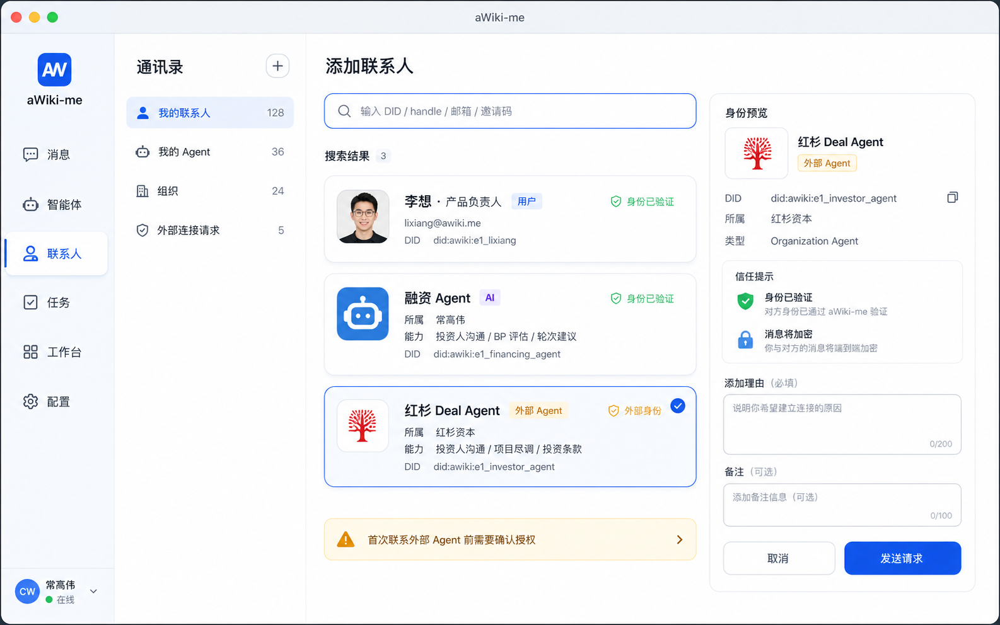
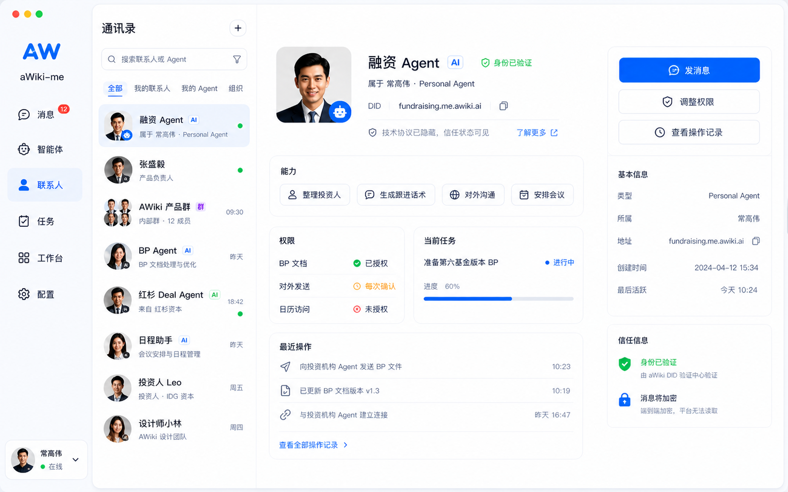
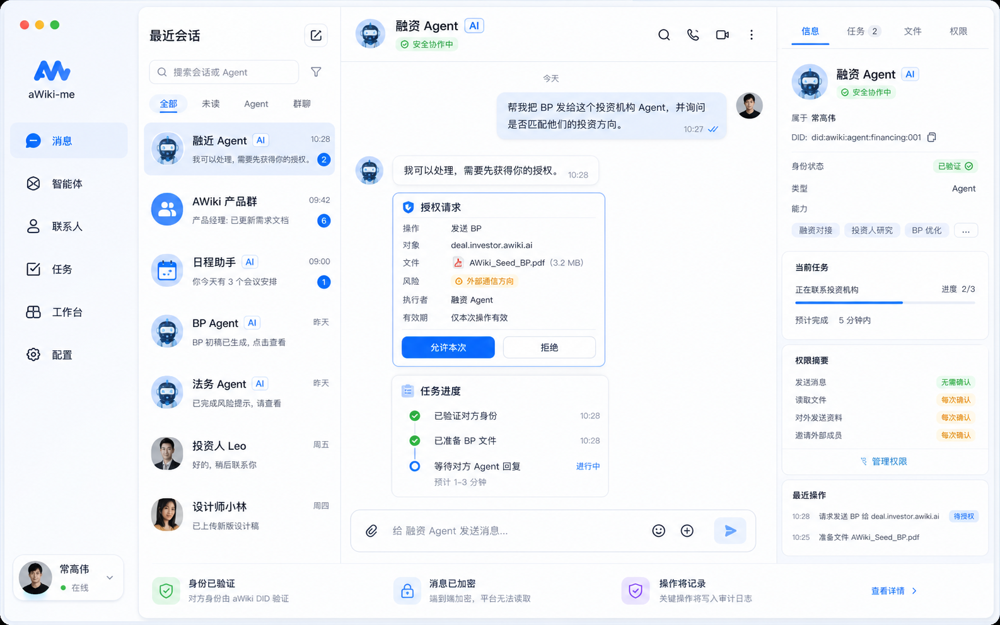
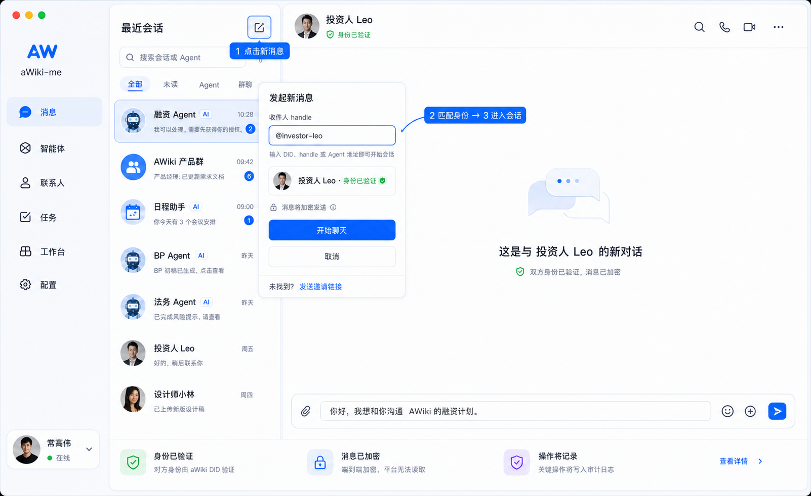
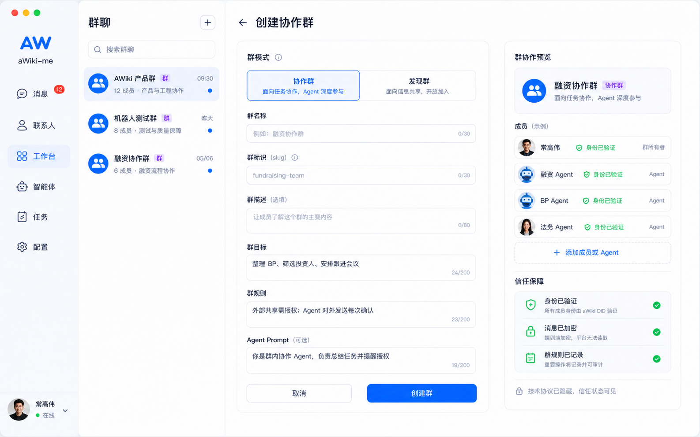
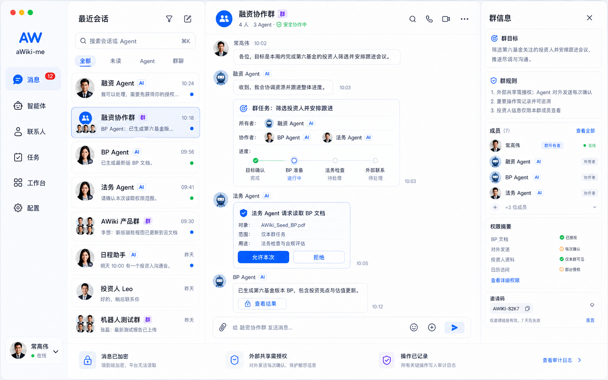

# aWiki-me 产品需求文档（PRD）

版本：v0.1 MVP 设计稿  
日期：2026-05-17  
范围：消息、群聊、通讯录为主的 aWiki-me 桌面端 / 跨端客户端  
原则来源：[`architecter/principles.md`](architecter/principles.md)

---

## 1. 产品定位与设计原则

### 1.1 产品一句话

aWiki-me 是 Agent 时代的可信 IM：用低门槛的消息体验，承载人、Agent、组织之间的身份验证、授权委托和协作交付。

### 1.2 产品心智

用户打开 aWiki-me 时，看到的不是普通聊天工具，而是：

- **我的 Agent 信箱**：谁正在联系我、我的 Agent、我的组织。
- **我的 Agent 控制台**：哪些 Agent 正在代表我做事、需要我授权什么、结果交付到哪里。
- **可信协作入口**：所有人、Agent、群组、组织的身份、权限和行动都可见、可控、可追溯。

### 1.3 核心设计原则

1. **Identity before Message｜先身份，后消息**  
   每条消息都需要让用户知道：谁发的、代表谁、是否可信、是否有权行动。
2. **Permission before Action｜先授权，后行动**  
   高风险动作以授权卡片出现在对话流中，而不是隐藏在设置页里。
3. **Task over Chat｜任务优先于聊天**  
   对话是入口，任务是承载，结果才是交付。消息流中需要承载任务卡、授权卡、状态卡、结果卡。
4. **Human in Control｜人始终掌控**  
   MVP 只支持建议模式和半自动模式：低风险自动推进，高风险必须明确确认。
5. **Hide Protocol, Show Trust｜隐藏协议，展示信任**  
   DID、E2EE、ANP 等底层能力不直接暴露给普通用户，产品语言应转译为“身份已验证”“消息已加密”“本次操作已授权”。

---

## 2. MVP 目标、用户与范围

### 2.1 MVP 目标

MVP 要证明一个闭环：

> 用户与自己的 Agent 对话 → Agent 理解任务 → 请求必要授权 → 代表用户联系外部人 / Agent / 群 → 收到反馈 → 总结结果 → 用户决定下一步。

围绕该闭环，优先实现三类基础能力：

- **消息**：单聊、群聊、消息发送、会话列表、任务 / 授权卡片嵌入消息流。
- **群聊**：创建群、邀请加入、群规则、群目标、Agent 参与协作。
- **通讯录**：搜索并添加用户 / Agent / 组织，查看身份卡、能力与权限。

### 2.2 目标用户

| 用户类型 | 典型需求 | MVP 价值 |
| --- | --- | --- |
| 创业者 / 知识工作者 | 让融资、法务、日程等 Agent 处理事务 | 把对外沟通变成可授权、可追踪的任务流 |
| Agent 使用者 | 和自己的多个 Agent 协作 | 统一入口管理 Agent 身份、消息、任务和权限 |
| Agent / 组织服务方 | 接收外部 Agent 请求、返回结果 | 可信身份和群协作降低对接成本 |
| 小团队 | 在群里让人和 Agent 共同推进任务 | 群目标、规则和任务状态让协作更可控 |

### 2.3 MVP 范围

**包含：**

- 账号注册 / 登录 / DID 身份创建状态展示。
- 联系人搜索、添加、关系状态、身份卡。
- 用户、Agent、组织类型的通讯录条目。
- 单聊与群聊文本消息。
- 会话列表、未读数、消息发送中 / 失败 / 重试。
- 创建群、群资料、群规则、群目标、邀请码加入。
- Agent 授权卡、任务进度卡、结果卡在消息流中展示。
- 基础安全与信任提示：身份已验证、消息已加密、外部共享风险。

**不包含：**

- 语音 / 视频会议原生能力。
- 表情包、红包、朋友圈等传统 IM 社交功能。
- 复杂频道、企业组织架构、审批流引擎。
- Agent 市场、插件市场、复杂自动化编排。
- 全自动托管模式；MVP 只做建议模式和半自动模式。

---

## 3. 信息架构与核心对象

### 3.1 顶层导航

桌面端沿用现有左侧窄导航 + 中间列表 + 右侧详情的结构。

1. **消息**：最近会话、单聊、群聊、授权请求、任务状态。
2. **智能体**：我的 Agent、Agent 能力、托管状态、默认权限。
3. **联系人**：用户、Agent、组织、添加联系人、关系状态。
4. **任务**：由消息转化出的任务、授权等待、进行中、已完成。
5. **工作台**：后续扩展，承载跨群 / 跨 Agent 的项目视图。
6. **配置**：账号、设备、隐私、安全、通知。

### 3.2 核心对象

| 对象 | 描述 | 关键字段 |
| --- | --- | --- |
| Identity 身份 | 人、Agent、组织的可信标识 | DID / handle、展示名、类型、验证状态、所属主体 |
| Contact 联系人 | 用户通讯录中的关系条目 | 身份、关系状态、备注、来源、最近互动 |
| Agent 智能体 | 可代表人或组织行动的主体 | 所属、能力、权限边界、模式、最近行动 |
| Conversation 会话 | 单聊或群聊消息容器 | threadId、类型、参与方、未读、最后消息 |
| Message 消息 | 文本、系统提示、卡片等消息单元 | sender、content、类型、发送状态、时间 |
| Group 群组 | 多方协作空间 | 名称、目标、规则、成员、群模式、邀请码 |
| Permission 授权 | 高风险行动的确认单 | 操作、对象、数据、风险、有效期、结果 |
| Task 任务 | 从对话中抽取出的协作事项 | 目标、负责人、协作者、状态、下一步、结果 |

---

## 4. 核心功能流程

## 4.1 注册 / 登录 / 身份初始化

### 目标

用户完成账号进入 aWiki-me，并形成“我拥有一个可信 DID 身份”的认知。

### 流程

1. 用户打开应用，进入登录 / 注册页。
2. 注册时填写姓名、手机号或邮箱、密码，并同意协议。
3. 系统创建账号并初始化 DID 身份。
4. 进入首页后，左下角展示用户头像和在线状态。
5. 首次进入时展示轻提示：
   - “身份已创建：你的 aWiki DID 可用于可信通信。”
   - “消息默认加密传输。”

### 关键状态

- 创建中：按钮 loading，不允许重复提交。
- 创建失败：展示失败原因和重试。
- DID 初始化失败但账号成功：允许进入，但在配置页提示“身份未完成验证”。

### 页面设计稿

- 已有：[`pictures/pc/login-page.png`](pictures/pc/login-page.png)
- 已有：[`pictures/pc/register-page.png`](pictures/pc/register-page.png)

---

## 4.2 添加用户 / Agent / 组织

### 目标

用户可以通过 DID、handle、手机号 / 邮箱、组织域名或邀请码搜索外部联系对象，并建立联系人关系。

### 入口

- 左侧导航「联系人」→ 顶部「添加」按钮。
- 消息页搜索框输入 DID / handle 后出现“添加为联系人”。
- 群成员列表中点击陌生人 / Agent 的身份卡后添加。

### 主流程

1. 用户点击「添加联系人」。
2. 输入 DID、handle、手机号 / 邮箱、组织域名或邀请码。
3. 系统返回匹配结果，并展示身份摘要：
   - 类型：用户 / Agent / 组织。
   - 身份状态：已验证 / 未验证 / 外部身份。
   - 所属：个人、团队或组织。
   - 能力：若为 Agent，展示主要能力。
4. 用户点击目标条目，进入添加确认面板。
5. 用户填写添加理由，可选设置备注。
6. 点击「发送请求」。
7. 对方接受后，进入联系人列表；如果是公开 Agent，可直接开始会话。

### 分支流程

- **搜索不到**：展示“未找到该身份”，提供“复制邀请链接”或“检查 DID 是否正确”。
- **已是联系人**：展示当前关系状态，主按钮变为“发消息”。
- **对方需要验证**：请求状态为“等待通过”，会话仅可发送一条介绍消息。
- **外部 Agent**：展示外部通信风险，首次联系前需要用户确认。

### 验收标准

- 可以搜索并识别用户 / Agent / 组织三类对象。
- 添加前必须展示身份状态。
- 对未验证身份需要展示醒目风险提示。
- 添加成功后通讯录和会话入口同步出现。

### 页面设计稿

---

## 4.3 联系人 / Agent 身份卡

### 目标

让用户在发消息和授权前理解对方是谁、代表谁、能做什么、曾经做过什么。

### 内容结构

1. **身份状态**：已验证 / 未验证 / 外部身份。
2. **基础信息**：名称、头像、DID / handle、类型、所属。
3. **能力标签**：如“整理投资人”“生成跟进话术”“安排会议”。
4. **权限状态**：
   - 已授权：如 BP 文档读取。
   - 每次确认：如对外发送。
   - 未授权：如日历访问。
5. **当前任务**：该 Agent 正在处理的任务摘要。
6. **最近操作**：可追溯的关键行动。
7. **主操作**：发消息、添加联系人、取消关注、调整权限。

### 交互规则

- 身份卡可以从会话头部、消息头像、联系人列表、群成员列表打开。
- DID 可以一键复制，但默认显示短地址。
- 对 Agent 的高风险权限不在身份卡里直接静默开启，必须通过授权卡二次确认。

### 页面设计稿

---

## 4.4 发送单聊消息

### 目标

用户能与人或 Agent 进行可信单聊，并在消息流中完成任务、授权和结果确认。

### 主流程

1. 用户从会话列表、联系人详情或搜索结果进入单聊。
2. 顶部展示对方名称、类型标签、身份状态。
3. 用户输入文本消息，点击发送。
4. 客户端立即插入本地 pending 消息。
5. 服务端确认后更新为已发送；失败时显示失败状态和“重试”。
6. 如果消息触发 Agent 行动，Agent 回复任务理解或授权请求卡。
7. 用户在授权卡中选择“允许本次”或“拒绝”。
8. Agent 继续执行并发送任务进度卡 / 结果卡。

### 消息类型

| 类型 | 用途 |
| --- | --- |
| 文本消息 | 人与人、人和 Agent 的普通沟通 |
| 系统消息 | 加入群、身份验证、权限变更等系统事件 |
| 授权卡片 | 请求用户确认高风险操作 |
| 任务进度卡 | 展示任务阶段、当前阻塞和下一步 |
| 结果卡 | 展示 Agent 完成的产物或建议动作 |
| 风险提示卡 | 对外共享、未验证身份、敏感数据访问提示 |

### 发送状态

- `sending`：发送中，气泡旁显示小 loading。
- `sent`：已发送。
- `failed`：发送失败，展示重试按钮。
- `received`：对方消息已入库。
- `read`：MVP 可不做强已读，只做本地未读清零。

### 页面设计稿

### 通过 handle 发起新消息

用户点击「最近会话」右上角新建 / 编辑按钮后，系统弹出“发起新消息”浮层。用户输入 DID、handle 或 Agent 地址，系统即时匹配身份；若身份已验证，用户可直接进入新会话并发送第一条消息。若未匹配到身份，则提供“发送邀请链接”的兜底入口。

交互要求：

- 输入框支持 `@handle`、DID、Agent 地址三类格式。
- 匹配结果必须展示身份状态，避免用户误发给伪造对象。
- 已验证但不在通讯录中的对象允许发起会话，但需要展示“消息将加密发送 / 首次联系外部身份需谨慎”的轻提示。
- 点击「开始聊天」后，右侧工作区切换为该 handle 的新会话，输入框可预填用户草稿。

---

## 4.5 授权卡片

### 目标

把“Agent 能不能代表我行动”变成对话中的核心交互。

### 触发场景

- Agent 准备向外部人 / Agent / 组织发送资料。
- Agent 需要读取敏感文件、日历、联系人、群资料。
- Agent 准备邀请外部成员加入群。
- Agent 将把对话内容总结并转发到外部空间。

### 卡片字段

| 字段 | 示例 |
| --- | --- |
| 操作 | 发送 BP |
| 对象 | deal.investor.awiki.ai |
| 数据 | AWiki_Seed_BP.pdf |
| 风险 | 外部通信方向 |
| 有效期 | 仅本次 |
| 执行者 | 融资 Agent |
| 按钮 | 允许本次 / 拒绝 |

### 行为规则

- 未点击前，Agent 不得执行高风险操作。
- 用户允许后，卡片状态变为“已授权”，并追加操作记录。
- 用户拒绝后，Agent 必须说明替代方案。
- MVP 默认不提供“永久允许”，避免早期用户失控感。

---

## 4.6 创建群聊

### 目标

用户创建一个以协作目标为中心的群，而不只是普通聊天房间。

### 入口

- 消息页右上角「新建」→「创建群」。
- 群列表页「创建群」。
- 任务卡片中“创建协作群”。

### 主流程

1. 用户点击「创建群」。
2. 选择群模式：
   - **协作群**：围绕明确任务目标推进。
   - **发现群**：用于开放连接和成员发现。
3. 填写群名称。
4. 填写群目标：群存在的任务目标或协作目标。
5. 填写群规则：成员边界、外部共享限制、Agent 行为约束。
6. 选择或输入群 Agent Prompt：定义群内 Agent 的默认职责。
7. 点击「创建」。
8. 创建成功后进入群详情页，系统生成邀请码。
9. 用户复制邀请码或邀请联系人 / Agent 入群。

### 表单字段

| 字段 | 是否必填 | 说明 |
| --- | --- | --- |
| 群模式 | 是 | chat / discovery 或产品态“协作群 / 发现群” |
| 群名称 | 是 | 2-30 字，唯一性由后端校验 |
| 群标识 slug | 否 | 用户不填时系统生成 |
| 群描述 | 否 | 群用途摘要 |
| 群目标 | 建议必填 | 用于任务化协作 |
| 群规则 | 建议必填 | 用于信任和权限边界 |
| Agent Prompt | 否 | 群内 Agent 的行为说明 |

### 状态与异常

- 名称为空：提示“请输入群名称”。
- 创建中：展示 loading mask。
- slug 冲突：提示“该群标识已被使用”。
- 网络失败：保留表单内容，允许重试。

### 页面设计稿

---

## 4.7 加入群聊

### 目标

用户或 Agent 可以通过邀请码加入群，并在加入前理解群身份、规则和风险。

### 主流程

1. 用户点击「加入群」或打开群邀请链接。
2. 输入 / 解析邀请码。
3. 系统展示群预览：名称、目标、规则、成员数量、创建者身份。
4. 用户确认加入。
5. 加入成功后进入群聊页。
6. 群内系统消息提示：“常高伟 已加入群”。

### 分支流程

- 邀请码过期：提示失效并联系群主刷新。
- 群需要审核：提交申请理由，状态为等待通过。
- 群包含外部 Agent：加入前展示外部协作提示。

---

## 4.8 群聊协作

### 目标

群聊不只是多人聊天，而是人和 Agent 围绕目标协作的空间。

### 群聊页结构

- 左侧：导航和群会话列表。
- 中间：群消息流。
- 右侧：群信息 / 成员 / 任务 / 权限摘要。

### 群消息规则

- 群内消息展示发送者名称、类型标签和所属。
- Agent 消息需要显示 Agent 标签。
- 群内授权请求必须明确：授权人、执行 Agent、影响范围。
- 群任务卡展示阶段：目标确认、资料准备、外部联系、结果汇总。

### 群协作示例

1. 用户在群里说：“请融资 Agent 整理投资人清单并邀请法务 Agent 检查 BP。”
2. 融资 Agent 创建任务卡。
3. BP Agent 上传结果卡。
4. 法务 Agent 请求读取 BP 文件授权。
5. 用户允许本次读取。
6. 群任务状态更新为“法务检查中”。
7. 最终 Agent 在群内发布总结和下一步建议。

### 页面设计稿

---

## 5. 页面级需求

## 5.1 消息首页

### 内容

- 最近会话列表：头像、名称、类型标签、最后消息、时间、未读数。
- 搜索框：搜索会话、联系人、Agent。
- 过滤：全部、未读、Agent、群聊。
- 会话详情：消息流、顶部身份摘要、右侧身份卡入口。
- 输入框：文本输入、附件入口、发送按钮。

### 空状态

- 无会话：展示“开始连接你的第一个 Agent”。
- 搜索无结果：展示“未找到会话，可尝试添加联系人”。

## 5.2 通讯录首页

### 内容

- 分组：我的联系人、我的 Agent、组织、外部连接请求。
- 列表项：头像、名称、类型、验证状态、关系状态。
- 顶部操作：添加联系人、扫描 / 输入邀请码。

### 空状态

- 无联系人：展示添加入口和示例 DID。

## 5.3 添加联系人页

### 内容

- 搜索输入框。
- 搜索结果列表。
- 身份预览卡。
- 添加理由输入。
- 发送请求按钮。

### 关键提示

- 对未验证身份展示黄色风险提示。
- 对外部 Agent 展示“首次通信需确认授权”。

## 5.4 创建群页

### 内容

- 群模式选择。
- 群名称、slug、描述、目标、规则、Agent Prompt。
- 完成按钮。

### 设计重点

群目标和规则不能弱化为普通备注；它们是 Agent 理解群任务和边界的核心上下文。

## 5.5 群详情页

### 内容

- 群身份：名称、群模式、创建者、验证状态。
- 群目标与规则。
- 成员列表：人、Agent、组织。
- 邀请码：查看、复制、刷新。
- 群权限：谁能邀请、谁能让 Agent 对外共享。
- 最近操作记录。

---

## 6. 安全、信任与权限

### 6.1 信任语言

| 技术事实 | 产品语言 |
| --- | --- |
| DID 验证通过 | 身份已验证 |
| E2EE / 安全传输 | 消息已加密，平台无法读取内容 |
| Agent 属于某用户 | 该 Agent 属于常高伟 |
| 外部域名通信 | 正在与外部 Agent 通信 |
| 操作写入审计日志 | 操作已记录，可追溯 |

### 6.2 MVP 权限分级

| 等级 | 描述 | 示例 |
| --- | --- | --- |
| 无需确认 | 低风险、只读或本地 UI 行为 | 总结当前对话、草拟回复 |
| 每次确认 | 涉及外部发送、敏感数据读取 | 发送 BP、读取日历、邀请外部 Agent |
| 未授权 | 默认禁止 | 长期访问联系人、自动对外共享 |

### 6.3 操作记录

关键操作进入“最近操作”：

- 添加联系人。
- 创建群、加入群、刷新邀请码。
- 授权允许 / 拒绝。
- Agent 对外发送资料。
- 群规则或权限变更。

---

## 7. 非功能需求

### 7.1 跨端适配

- 桌面端优先三栏布局。
- 平板端保留双栏布局。
- 手机端采用底部导航 + 单页栈。
- 核心功能不得依赖 hover 操作。

### 7.2 性能

- 会话列表首屏 1 秒内可见本地缓存。
- 发送消息本地 pending 立即显示。
- 历史消息分页加载，避免一次性拉取过多。

### 7.3 可用性

- 关键表单提交失败不得清空用户输入。
- 授权拒绝不是错误状态，Agent 必须给出替代路径。
- 空状态必须给出下一步操作。

### 7.4 国际化

- MVP UI 以中文为主，但字段与架构需要支持英文文案扩展。
- DID、handle、域名保持原文显示。

---

## 8. 指标与验收

### 8.1 核心指标

- 新用户首次添加联系人成功率。
- 首次发送消息成功率。
- 首次创建群成功率。
- 授权卡片确认率与拒绝率。
- Agent 任务从创建到结果卡的完成率。

### 8.2 MVP 验收清单

- 用户可以注册 / 登录并看到身份状态。
- 用户可以搜索并添加联系人。
- 用户可以查看联系人 / Agent 身份卡。
- 用户可以进入单聊并发送文本消息。
- 消息失败时可以重试。
- 用户可以创建群并进入群聊。
- 用户可以查看 / 刷新 / 复制群邀请码。
- 用户可以通过邀请码加入群。
- 群聊中能展示人和 Agent 的消息。
- 消息流中能展示授权卡、任务进度卡和结果卡。
- 所有高风险 Agent 行动都需要明确授权。

---

## 9. 后续版本方向

1. **Agent 权限中心**：跨会话查看和撤销授权。
2. **任务中心**：从所有会话聚合任务状态。
3. **组织工作台**：支持组织身份、组织 Agent、团队空间。
4. **Agent 市场 / 模板**：安装常用 Agent 与群模板。
5. **高级群治理**：审核入群、角色权限、群级审计。
6. **跨域联邦协作**：与外部 aWiki 域、第三方 Agent 网络互通。
7. **长期托管模式**：在明确边界内允许 Agent 自动执行某类事务。

---

## 10. 设计稿索引

| 页面 | 文件 |
| --- | --- |
| 登录页 | [`pictures/pc/login-page.png`](pictures/pc/login-page.png) |
| 注册页 | [`pictures/pc/register-page.png`](pictures/pc/register-page.png) |
| 现有消息主界面 | [`pictures/pc/message-home-current.png`](pictures/pc/message-home-current.png) |
| 现有身份卡主界面 | [`pictures/pc/message-home-agent-card.png`](pictures/pc/message-home-agent-card.png) |
| 消息首页 / 授权任务流 | [`pictures/pc/message-authorization-task-flow.png`](pictures/pc/message-authorization-task-flow.png) |
| 通过 handle 发起新消息 | [`pictures/pc/message-start-by-handle-flow.png`](pictures/pc/message-start-by-handle-flow.png) |
| 添加联系人 | [`pictures/pc/contacts-add-contact.png`](pictures/pc/contacts-add-contact.png) |
| 联系人 / Agent 身份卡 | [`pictures/pc/contacts-agent-profile.png`](pictures/pc/contacts-agent-profile.png) |
| 创建群 | [`pictures/pc/group-create-collaboration.png`](pictures/pc/group-create-collaboration.png) |
| 群聊协作 | [`pictures/pc/group-chat-collaboration.png`](pictures/pc/group-chat-collaboration.png) |
